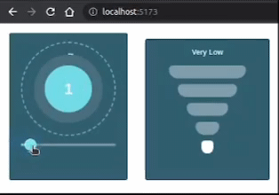

   # INTELLECT ASSIGNMENT



***

>   ## RUNNING THE WEB-APPLICATION

1. Open the terminal and change into the project directory and run the below given command to install the files required to run the project in development mode.

    ```bash
    npm install
    ```

2. Start the development server using below given command.

    ```bash
    npm run dev
    ```

3. The above command start the development server on port `5173` (assuming the port is available and in case there is some other port, that will be displayed on the terminal, use that in case). View the website at [http://localhost:5173](http://localhost:5173)

***
***

> ## PACKAGES USED

    "@emotion/react": "^11.10.5",
    "@emotion/styled": "^11.10.5",
    "@mui/material": "^5.11.7",
    "react": "^18.2.0",
    "react-circular-progressbar": "^2.1.0",
    "react-dom": "^18.2.0"

***